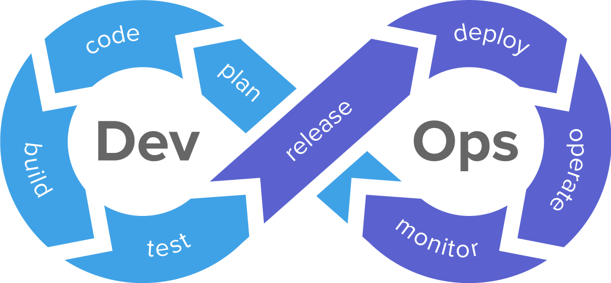

# MLOps

DevOps - (development and operations) - набор практик, нацеленных на активное взаимодействие специалистов по разработке,
тестированию и эксплуатации. Основные понятия:
* CI - Continuous Integration (сборка кода и загрузка собранного ПО в среду разработки)
* CD - Continuous delivery (CI-практики, дополненные автоматизированным развертыванием на тестовую среду, а также автотесты)
* CDP - Continuous Deployment (CI и CD-практики для поставки ПО в промышленную среду)

  

MLOps — набор практик, нацеленных на надежное и эффективное развертывание и поддержание моделей машинного обучения на производстве.

ETL (Extract, Transform, Load) — это процесс в управлении хранилищами данных (миграция из источника в источник), который включает в себя:
* извлечение данных из источников
* преобразование данных
* загрузка данных в хранилище

## Инструменты автоматизации
* Системы сбора, хранения и обработки Big Data:
  * Data Warehouse (DWH): Greenplum, Vertica
  * Data Lake: Apache Hadoop
* Continuous Delivery tools: Jenkins, GoCD, Team City, Circle CI
* Worker: AirFlow
* Logger: Clickhouse
* Брокеры сообщений: Apache Kafka, RabbitMQ, Redis

### Jenkins
Jenkins - CDP-инструмент для сборки дистрибутивов, над которыми трудится несколько разработчиков (один артефакт).
Это своеобразный конвейер (pipeline) поставки ПО от среды разработки в промышленную среду.

Jenkins pipeline: build, deploy, tests ==> collect data

Jenkins Архитектура
1. Jenkins Master (голова)
   * Все jobs
   * Конфигурации
2. Jenkins Slave
   * Машина, где записано выполнение шагов (Job)
   * Docker container

### AirFlow
Airflow - это фреймворк для разработки, планирования и мониторинга рабочих процессов. Основные понятия:
* Directed Acyclic Graph - DAG
* Операторы - сущностей, связанных с заданиями, которые будут выполняться при движении по графу
* Планировщик задач (Celery)
* Мониторинг задач (Zeppelin)

### Clickhouse
ClickHouse — колоночная СУБД для онлайн-обработки аналитических запросов (OLAP - Online Analytical Processing).

### Брокеры сообщений
Брокеры сообщений – это модули ПО, благодаря которым приложения могут обмениваться информацией и взаимодействовать между собой.

[Apache Kafka и RabbitMQ: в чем разница и что лучше изучать?](https://habr.com/ru/companies/slurm/articles/666326/)

### Postman
Postman - инструмент для работы с API, который позволяет посылать запросы к сервисам и работать с их ответами.

Достоинства:
* Поддерживает разные API (REST, SOAP, GraphQL)
* Расширяется под любые нужды с помощью Postman API
* Легко интегрируется в CI/CD с помощью Newman - консольной утилиты для запуска тестов

## Литература / курсы
* deploy ml_course by Artem Seleznev
  * [git](https://github.com/NameArtem/deployml_course#about)
  * [youtube](https://www.youtube.com/playlist?list=PLEwK9wdS5g0qBXa94W7W0RNmrE0Ruook4)
