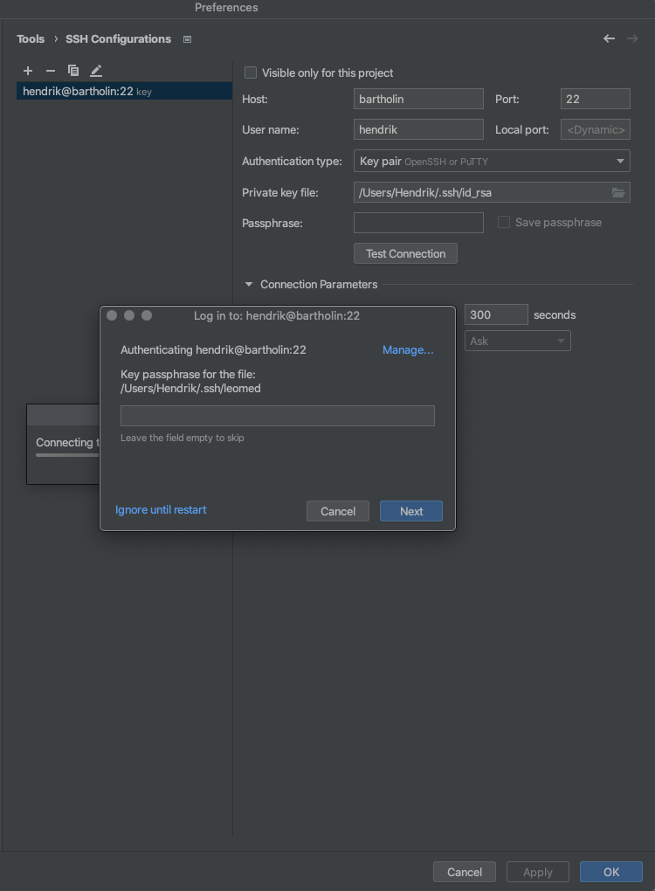
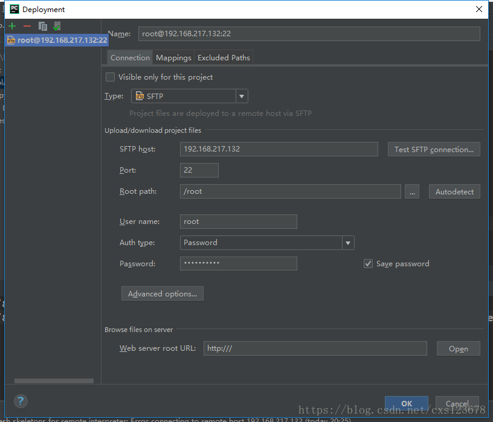
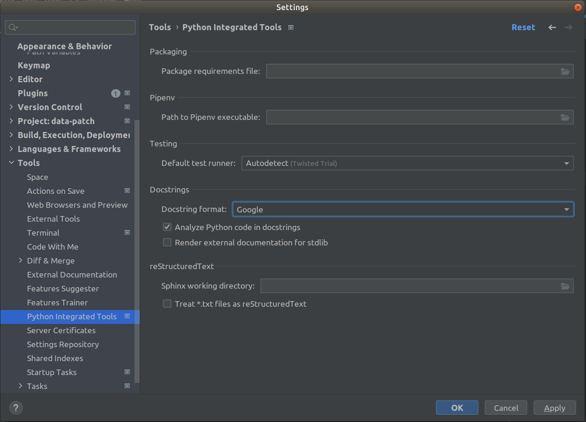
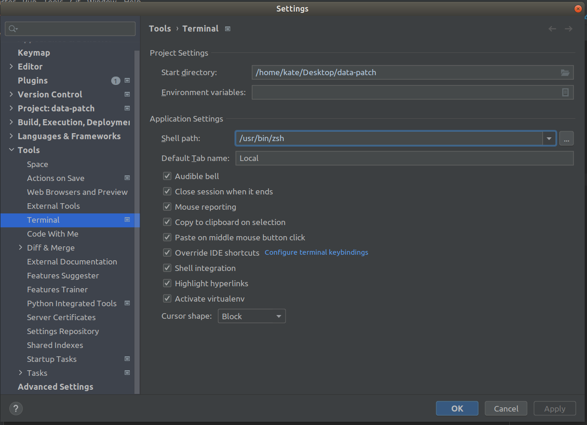

# Pycharm cheat sheets

## SSH connection

  

## Deployment
### Configuration and mapping
Tools ==> Deployment ==> Configuration

  

### Exclude files by mask
Tools ==> Deployment ==> Option

## Disable duplicate code detection
File ==> Settings ==> Editor ==> Inspections ==> General ==> Duplicated code fragment

## Add git tracking for folder
File ==> Settings ==> Version Control ==> Directory Mapping

## Fix project structure
ПКМ ==> Mark directory as ==> Source root

## Google style docstring
File ==> Settings ==> Tools ==> Python integrated tools ==> Docstrings ==> Docstring format: Google

  

## Bash-style терминал

  

