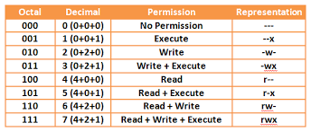

# Shell cheat sheets

## Горячие клавиши
* ```Ctrl + Alt + T``` - открыть консоль
* ```Ctrl + Shift + T``` - новая вкладка в терминале
* ```Ctrl + Shift + C / V``` - работа с текстом в терминале
* ```Ctrl + H``` - показать / скрыть скрытые файлы
* ```Ctrl + R``` - поиск по ранее выполненным командам
* ```Alt + <TAB>``` - переключение между открытыми приложениями
* ```Ctrl + <TAB>``` - переключение по вкладкам браузера

## UNIX
* 1983 - Ричард Стокман анонсировал GNU
* 1991 - Линус Торвальд зарелизил первую версию ядра Linux Kernel

Linux - это **ядро**

Дистрибутив - это ОС, включающая в себя:
* Ядро Linux
* Библиотеки и утилиты
* Приложения
* Программы для установки и конфигурационные файлы системы

## Оболочка Linux
Shell (терминал, консоль, командная строка) - командная оболочка - программа, которая принимает команды, введенные с клавиатуры, и передает их ОС для выполнения.

На Linux, по умолчанию, язык оболочки называется BASH (Bourne Again Shell).
Bash - командная оболочка из проекта GNU.

```$``` - shell prompt - приглашение к вводу

```#``` - сеанс суперпользователя (sudo)

**Структура команды:** ```<команда> -<ключ> <значение>```

* ```man <команда>``` - мануал (справочное руководство) по команде
* ```<команда> --help``` - вывод инструкции по использованию
* ```help <команда>``` - справка по команде
* ```time <команда>``` - исполнить команду и составить статистику о том, сколько времени потрачено на исполнение
* ```htop``` - диспетчер задач
* ```clear``` - очистка экрана
* ```history``` - выводит содержимое истории команд
  * ```history | less```
  * ```history | grep /user/bin```
* ```type <команда>``` - получение типа команды
* ```which``` - определение местоположения выполняемого файла

## Вывод информации о системе
* ```whoami``` - имя пользователя
* ```uptime``` - состояние системы
* ```uname -a``` - информация о ядре ОС
* ```lsb_release -a``` - информация об ОС
* ```yelp``` - руководство пользователя Ubuntu
* ```free``` - объем памяти и ее использование
* ```df``` - объем свободного пространства на дисках
* ```sudo dmidecode``` - вывод информации об аппаратном обеспечении
* ```sudo lshw -C```
* ```du -ha``` - показать размер на диске для директорий и их содержимого

## Остановка системы
* ```halt``` - остановить
* ```poweroff``` - выключить питание
* ```reboot``` - перезагрузить
* ```shutdown``` - объединение первых трех + можно указать время:
  * ```sudo shutdown -h now``` - остановка
  * ```sudo shutdown -r now``` - перезагрузка

## Привилегии
[Chmod Calculator](https://chmodcommand.com/)

Unix - многопользовательская ОС. Пользователи могут объединяться в группы.

```id``` - выводит информацию об идентичности пользователя (uid, grid, groups)

Права доступа к файлам и каталогам определяются в терминах прав на чтение, запись и выполнения:
```
ls -l foo.txt
# -rw-rw-r--  1  me  me  0  2018-03-06  14:52  foo.txt
```

<p align="center">
  
</p>

**chmod** - изменяет режим доступа к файлу

```
./my_scr.sh
# Permition denied

# Тогда:
chmod +x my_scr.sh
./my_sch.sh 
```

chmod также поддерживает символическую форму определения режимов доступа к файлу. Символическая форма записи делится на 3 части:
* для кого устанавливается разрешения
* какие операции с разрешениями будут выполняться
* на какие разрешения эти операции будут влиять

## Сответствие консольных команд Windows и Linux

[Сответствие консольных команд Windows и Linux](https://white55.ru/cmd-sh.html)
